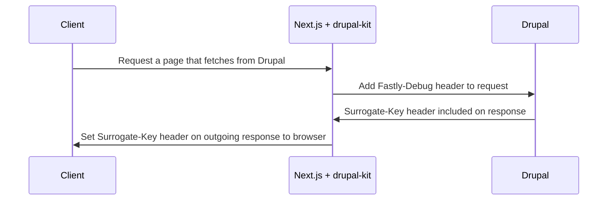

## Before You Begin

You should be familiar with the concept of surrogate key based caching and
purging.

See https://docs.fastly.com/en/guides/working-with-surrogate-keys for more
information on working with surrogate keys.

This guide uses Drupal with the
[Pantheon Advanced Page Cache module](https://www.drupal.org/project/pantheon_advanced_page_cache)
installed.

## How It Works



The `PantheonDrupalState` class from our `@pantheon-systems/drupal-kit` npm
package includes an adapted fetch method which adds the `Fastly-Debug` header to
each request to Drupal. Responses from Drupal will contain the `Surrogate-Key`
header. With these keys, your frontend can be instructed to purge content from a
cache when the content in Drupal changes.

## How To Ensure Headers Are Set On Custom Routes

:::note

The Decoupled Kit
[Drupal Back-end Starter Project](../../../Backend%20Starters/Decoupled%20Drupal/creating-new-project.md)
and [Drupal Next.js Starter Kit](./intro.md) handle the configuration below
automatically.

:::

- The Drupal backend has the
  [Pantheon Advanced Page Cache module](https://www.drupal.org/project/pantheon_advanced_page_cache)
  installed.
- Create an instance of `PantheonDrupalState` imported from
  `@pantheon-systems/drupal-kit` in your application.
- Use the fetch methods available (see
  [`drupal-kit`](../../../Packages/drupal-kit/) for more information). The
  Surrogate-Key header should be set automatically if Drupal is configured
  correctly.
- Pass the
  [`context.res`](https://nextjs.org/docs/api-reference/data-fetching/get-server-side-props#context-parameter)
  from `getServerSideProps` into the `PantheonDrupalState` fetch method so that
  the headers are added to the outgoing response.

For example, the following code could be used to set the headers necessary for
cache purging on an article list page:

1. In your article list page, create an instance of DrupalState:

```js title="src/pages/articles/index.js"
import { DrupalState } from '@pantheon-systems/drupal-kit';

const store = new DrupalState({
	apiBase: 'https://my-drupal-site.pantheonsite.io',
});
```

2. In `getSeverSideProps` use the `store` instance to fetch data from Drupal and
   provide the outgoing response object:

```js title="src/pages/articles/index.js"
export async function getServerSideProps(context) {
	const articles = await store.getObject({
		objectName: 'node--article',
		res: context.res,
	});

	return { props: { articles } };
}
```

Assuming that your backend is correctly configured, you should now see the
`Surrogate-Key` header on the outgoing response for `/articles/`, which will
allow the cache for this page to be purged automatically when any related
content changes in Drupal.
