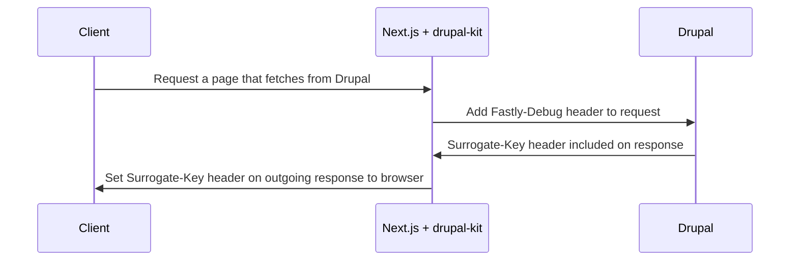

## Before You Begin

You should be familiar with the concept of surrogate key based caching and
purging.

See https://docs.fastly.com/en/guides/working-with-surrogate-keys for more
information on working with surrogate keys.

This guide uses Drupal with the
[Pantheon Advanced Page Cache module](https://www.drupal.org/project/pantheon_advanced_page_cache)
installed.

## How It Works

The `PantheonDrupalState` class from our `@pantheon-systems/drupal-kit` npm
package includes an adapted fetch method which adds the `Pantheon-SKey` header
to each request to Drupal. Responses from Drupal will contain the
`Surrogate-Key` header. With these keys, your frontend can be instructed to
purge content from a cache when the content in Drupal changes.

## How To Ensure Headers Are Set On Custom Routes

- The Drupal backend has the
  [Pantheon Advanced Page Cache module](https://www.drupal.org/project/pantheon_advanced_page_cache)
  installed. installed and configured
- Create an instance of `PantheonDrupalState` imported from
  `@pantheon-systems/drupal-kit` in your application.
- Use the fetch methods available (see
  [`drupal-kit`](../../../Packages/drupal-kit/) for more information). The
  Surrogate-Key header should be set automatically if Drupal is configured
  correctly.
- Pass the
  [`context.res`](https://nextjs.org/docs/api-reference/data-fetching/get-server-side-props#context-parameter)
  from `getServerSideProps` into the `PantheonDrupalState` fetch method so that
  the headers are added to the outgoing response.
