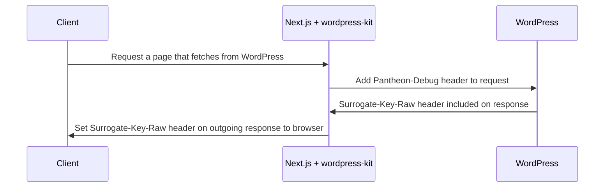

## Before You Begin

You should be familiar with the concept of surrogate key based caching and
purging.

See https://docs.fastly.com/en/guides/working-with-surrogate-keys for more
information on working with surrogate keys.

This guide uses WordPress with the
[WPGraphQL plugin](https://wordpress.org/plugins/wp-graphql/) and the
[Pantheon Advanced Page Cache plugin](https://wordpress.org/plugins/pantheon-advanced-page-cache/)
installed.

## How It Works

The `GraphqlClientFactory` class from our `@pantheon-systems/wordpress-kit` npm
package adds the `Pantheon-Debug` header to each request. Responses from
WordPress will contain the `Surrogate-Key-Raw` header. With these keys, your
frontend can be instructed to purge content from a cache when the content in
WordPress changes.

## How To Ensure Headers Are Set On Custom Routes

- The WordPress backend has the
  [WPGraphQL plugin](https://wordpress.org/plugins/wp-graphql/) installed and
  configured
- The WordPress backend has the
  [Pantheon Advanced Page Cache plugin](https://wordpress.org/plugins/pantheon-advanced-page-cache/)
  installed and configured
- The route fetches data using the `@pantheon-systems/wordpress-kit` Graphql
  client or requests to WordPress include the `Pantheon-Debug: 1` header
  - in order to see the headers, you must use the `client.rawRequest()` method.
- The headers must be added to the outgoing response from Next.js in
  `getServerSideProps` (see
  [`context.res`](https://nextjs.org/docs/api-reference/data-fetching/get-server-side-props#context-parameter)).
  - The
    [`next-wordpress-starter` includes a helper function](https://github.com/pantheon-systems/decoupled-kit-js/blob/f3eebf4b502cbad123ec8a7fcd4d4f8f0fb413eb/starters/next-wordpress-starter/lib/setOutgoingHeaders.js#L25)
    that combines headers from multiple requests and adds them to the outgoing
    response.
