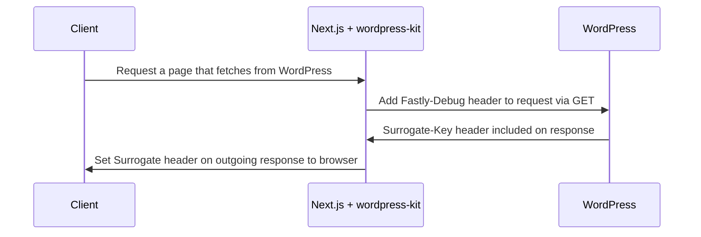

## Before You Begin

You should be familiar with the concept of surrogate key based caching and
purging.

See https://docs.fastly.com/en/guides/working-with-surrogate-keys for more
information on working with surrogate keys.

This guide uses WordPress with the
[WPGraphQL plugin](https://wordpress.org/plugins/wp-graphql/),
[WPGraphQL Smart Cache plugin](https://github.com/wp-graphql/wp-graphql-smart-cache)
and the
[Pantheon Advanced Page Cache plugin](https://wordpress.org/plugins/pantheon-advanced-page-cache/)
installed.

## How It Works



The `GraphQLClientFactory` class from our `@pantheon-systems/wordpress-kit` npm
package adds the `Fastly-Debug` header to each request and uses the GET method
by default to take advantage of WPGraphQL Smart Cache network caching. Responses
from WordPress will contain the `Surrogate-Key` header. With these keys, your
frontend can be instructed to purge content from a cache when the content in
WordPress changes.

## How To Ensure Headers Are Set On Custom Routes

:::note

The Decoupled Kit
[WordPress Back-end Starter Project](../../../Backend%20Starters/Decoupled%20WordPress/creating-new-project.md)
and [WordPress Next.js Starter Kit](./intro.md) handle the configuration below
automatically.

:::

- The WordPress backend has the
  [WPGraphQL plugin](https://wordpress.org/plugins/wp-graphql/) installed and
  configured
- The WordPress backend has the
  [WPGraphQL Smart Cache plugin](https://github.com/wp-graphql/wp-graphql-smart-cache)
  installed and configured, with the Object Cache option disabled
- The WordPress backend has the
  [Pantheon Advanced Page Cache plugin](https://wordpress.org/plugins/pantheon-advanced-page-cache/)
  installed and configured
- The route fetches data using the `@pantheon-systems/wordpress-kit` Graphql
  client or requests to WordPress are made using the GET method and include the
  `Fastly-Debug: 1` header
  - in order to see the headers, you must use the `client.rawRequest()` method.
- The headers must be added to the outgoing response from Next.js in
  `getServerSideProps` (see
  [`context.res`](https://nextjs.org/docs/api-reference/data-fetching/get-server-side-props#context-parameter)).
  - The
    [`next-wordpress-starter` includes a helper function](https://github.com/pantheon-systems/decoupled-kit-js/blob/f3eebf4b502cbad123ec8a7fcd4d4f8f0fb413eb/starters/next-wordpress-starter/lib/setOutgoingHeaders.js#L25)
    that combines headers from multiple requests and adds them to the outgoing
    response.

For example, the following code could be used to set the headers necessary for
cache purging on a post list page:

1. In your post list page, import required utilities and create an instance of
   the GraphQL Client:

```js title="src/pages/posts/index.js"
import {
	gql,
	GraphQLClientFactory,
	setEdgeHeader,
	setSurrogateKeyHeader,
	setOutgoingHeaders,
} from '@pantheon-systems/wordpress-kit';

const client = new GraphQLClientFactory(
	'https://dev-wordpress-purge-demo.pantheonsite.io/wp/graphql',
	{
		method: 'GET',
	},
).create();
```

2. In `getSeverSideProps` use the `client` instance to fetch data from
   WordPress. Then use utilities provided by `wordpress-kit` to set caching
   related headers on the outgoing response:

```js title="src/pages/posts/index.js"
export async function getServerSideProps({ res }) {
	// Customize your query as needed
	const query = gql`
		query LatestPostsQuery($totalPosts: Int!) {
			posts(first: $totalPosts) {
				edges {
					node {
						id
						uri
						title
						featuredImage {
							node {
								altText
								sourceUrl
							}
						}
					}
				}
			}
		}
	`;

	// Retrieve post data and surrogate key values from WordPress
	const {
		data: {
			posts: { edges },
		},
		headers,
	} = await client.rawRequest(query, { totalPosts: 100 });
	const posts = edges.map(({ node }) => node);

	// Add unique surrogate keys to outgoing response
	// and set cache control header to ensure response is cached at edge
	setOutgoingHeaders({ headers, res });

	return { props: { posts } };
}
```

Assuming that your backend is correctly configured, you should now see the
`Surrogate-Key` header on the outgoing response for `/posts/`, which will allow
the cache for this page to be purged automatically when any related content
changes in WordPress.
